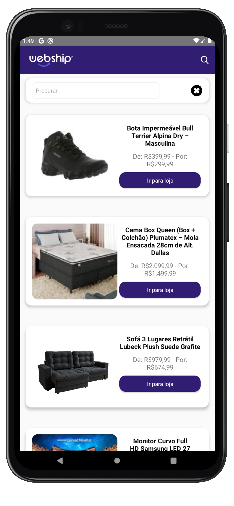

# webship-app

<p>A simple e-commerce application created to practice redux concepts.</p>

## Screenshots

<h1>
  
</h1>

## Technologies

- [React Native](https://reactnative.dev/)
- [Redux](https://redux.js.org/)

## Install

```bash
# Clone this repository
$ git clone git@github.com:lucalves/webship-app.git

# Go into the repository
$ cd webship-react-app

# Open the repository in the IDE (If you use VS Code)
$ code .

# Install dependencies with npm or yarn
$ yarn or npm install
```

## License

MIT

# Start the application
$ yarn android (or yarn ios)

# Ready!
```
